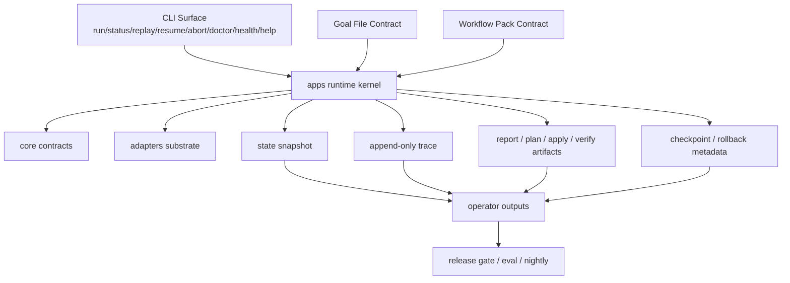

# 제품 청사진

## 1. 한 줄 정의

**AxiomRunner는 explicit goal contract와 workflow pack contract를 입력받아 단일 workspace 안에서 bounded autonomous 개발 작업을 계획·실행·검증·복구·보고하고, 그 전 과정을 replay 가능한 evidence로 운영하는 CLI runtime이다.**

---

## 2. 왜 이 정의가 맞는가

현재 저장소가 직접 잠그는 사실은 아래와 같다.

- 제품 identity는 `AxiomRunner` / `axiomrunner_apps` / `AXIOMRUNNER_*`다.
- retained CLI surface는 `run/status/replay/resume/abort/doctor/health/help`다.
- current truth는 `docs/`와 루트 `README.md`가 소유한다.
- bridge 문서는 `AUTONOMOUS_AGENT_TARGET` / `AUTONOMOUS_AGENT_SPEC`이지만, current truth와 다르면 current truth가 release 기준이다.
- next target은 **single-workspace autonomous agent**이며,
  - single-agent first
  - workspace-bound execution
  - verify-before-done
  - hidden fallback 금지
  - operator-visible failure
  - eval-driven release
  를 비타협 원칙으로 둔다.

즉 저장소가 스스로 약속하는 최종 방향은 **넓은 플랫폼**이 아니라
**좁은 runtime kernel + strong autonomous loop + operator evidence**다.

---

## 3. 도달 목표

완성본의 목표는 다음 한 문장으로 정리된다.

> **좁은 CLI runtime을 유지하면서, 그 위에 workflow-pack 기반 verifier-first autonomous developer harness를 완성하는 것.**

이 목표는 두 가지를 동시에 만족해야 한다.

### 3.1 의미를 좁게 유지
- public surface 확대 금지
- daemon/service/gateway/cron/channel/marketplace 복귀 금지
- multi-agent 확장 금지
- hidden fallback provider 금지

### 3.2 의미를 깊게 완성
- goal schema가 실제 정책과 연결되어야 함
- verification이 done 판단을 실제로 잠가야 함
- blocked / approval / budget / failed 이유가 status/replay/report/doctor에서 같아야 함
- rollback / checkpoint / trace / report가 하나의 evidence chain으로 읽혀야 함
- representative examples / nightly / release gate가 출하 기준이 되어야 함

---

## 4. 완성본 제품 정의

## 4.1 제품 정체성
- **형태**: CLI runtime
- **주 사용자**: 로컬 workspace에서 bounded autonomous 개발 작업을 운영하는 operator / developer
- **실행 범위**: 단일 local workspace
- **실행 단위**: explicit `goal file`
- **도메인 확장 단위**: explicit `workflow pack`
- **실행 substrate**: provider / tool / memory adapter

## 4.2 완성본 public surface
완성본에서도 public surface는 아래 8개로 유지한다.

- `run <goal-file>`
- `status [run-id|latest]`
- `replay [run-id|latest]`
- `resume [run-id|latest]`
- `abort [run-id|latest]`
- `doctor [--json]`
- `health`
- `help`

### 표면 규칙
- `resume`은 generic restart가 아니다.
- `resume`은 `waiting_approval` 상태 pending run 승인 후 재개 전용이다.
- `abort`는 rerun이 아니다.
- `abort`는 pending control state를 terminal outcome으로 닫는 control이다.

## 4.3 완성본이 실제로 약속해야 하는 것
1. **goal file을 받아 run을 시작한다.**
2. **workspace boundary 안에서만 동작한다.**
3. **verification evidence 없이 success를 만들지 않는다.**
4. **weak / unresolved / pack_required verifier는 blocked로 보인다.**
5. **approval / budget / blocked / failed / aborted 이유가 operator-visible하다.**
6. **report / replay / trace / state snapshot이 같은 run 의미를 재구성할 수 있다.**
7. **workflow pack은 도메인별 verifier / tool / risk 힌트만 준다.**
8. **adapter는 runtime semantics를 바꾸지 못한다.**
9. **nightly / eval / release gate가 계약 drift를 막는다.**

---

## 5. 완성본 아키텍처 청사진

### 해석
- `core`는 의미를 정의한다.
- `apps`는 의미를 실행 흐름으로 묶는다.
- `adapters`는 실제 외부 실행을 담당한다.
- evidence 계층은 operator truth를 만든다.
- release 계층은 drift를 차단한다.

---

## 6. 완성본 운영 원칙

## 6.1 semantic ownership
### 본체가 소유하는 것
- goal / run / resume / abort 의미
- terminal outcomes 의미
- verify-before-done rule
- status / replay / report / doctor schema
- trace / rollback / checkpoint evidence semantics

### pack이 소유하는 것
- planner hints
- allowed tools 축소
- verifier rules
- verifier flow 순서
- risk hints

### adapter가 소유하는 것
- provider backend
- tool backend
- memory backend
- health probe detail

## 6.2 release 원칙
- current truth > bridge docs
- example > marketing
- e2e/release gate/nightly metrics > 설명 문장
- false success 허용 금지
- hidden fallback success 허용 금지

---

## 7. non-goal

완성본에서도 아래는 제품 약속에 포함하지 않는다.

- multi-agent orchestration
- daemon / service lifecycle
- HTTP gateway mode
- cron scheduling
- channels
- skills marketplace
- broad integrations catalog
- generalized memory platform
- broad platform shell

---

## 8. completion checklist

완성본은 아래가 동시에 참이어야 한다.

- public surface가 고정되어 있다.
- identity drift가 없다.
- goal / pack / outcome / report vocabulary가 문서/코드/테스트에서 같다.
- constraint enforced subset이 실제 정책으로 동작한다.
- verification weak/unresolved/pack_required가 success로 숨겨지지 않는다.
- state/status/doctor/replay/report가 한 run 의미를 재구성한다.
- rollback/checkpoint/trace append policy가 operator 루프에서 읽힌다.
- nightly + eval + release gate가 representative run을 잠근다.
