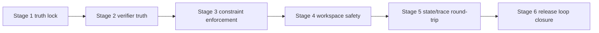

# 07_IMPLEMENTATION_PLAN

## 목적

이 계획의 목적은 **현재 제품 계약을 깨지 않으면서**, AxiomRunner를 제품급 완성 상태로 닫는 **가장 짧은 critical path**를 제시하는 것이다.

핵심 원칙:

- public surface 확대 금지
- semantics drift 금지
- hardening 우선
- verifier truth 우선
- workspace safety/evidence 우선
- docs truth lock 우선

---

## Stage 0. 작업 원칙

### 절대 규칙
- `run/status/replay/resume/abort/doctor/health/help` 외 새 public command 추가 금지
- `run/resume/abort` semantics 변경 금지
- `success` 기준 완화 금지
- workflow pack이 terminal outcome/replay schema를 바꾸게 하면 안 됨
- experimental surface를 기본 제품 경로로 올리면 안 됨

### 현재 건드리면 안 되는 영역
- multi-agent
- daemon/service/gateway
- cron
- channel integration
- marketplace
- broad integrations
- generalized memory platform
- broad new provider expansion

---

## Stage 1. Contract truth matrix 고정

### 목표
문서, CLI usage, operator output, report, tests가 **같은 run vocabulary**를 사용하게 잠근다.

### 수정 대상
- `README.md`
- `docs/project-charter.md`
- `docs/CAPABILITY_MATRIX.md`
- `docs/RUNBOOK.md`
- `docs/README.md`
- `crates/apps/src/cli_command.rs`
- `crates/apps/src/operator_render.rs`
- `crates/apps/tests/release_security_gate.rs`

### 완료 조건
- retained surface 문자열이 current truth docs와 usage에 동일하게 존재
- identity (`AxiomRunner` / `axiomrunner_apps` / `AXIOMRUNNER_*`)가 단일화
- status/doctor/replay/report의 key vocabulary가 동일
- release gate가 forbidden legacy token / naming drift / bridge/current drift를 차단

### 검증 방법
```bash
cargo test -p axiomrunner_apps --test release_security_gate
```

### 선행 조건
없음

### 산출물
- truth vocabulary matrix
- forbidden token gate
- naming truth gate
- current-vs-bridge doc boundary gate

---

## Stage 2. Verifier truth lock

### 목표
**verification이 success를 실제로 잠그게** 만든다.

### 수정 대상
- `crates/apps/src/runtime_compose/plan.rs`
- `crates/apps/src/cli_runtime/lifecycle.rs`
- `crates/apps/src/runtime_compose/artifacts.rs`
- `crates/apps/src/operator_render.rs`
- `crates/apps/tests/e2e_cli.rs`
- `crates/apps/tests/autonomous_eval_corpus.rs`
- `crates/apps/tests/release_security_gate.rs`
- representative example packs

### 해야 할 일
1. verifier detail direct-command path를 유지
2. non-command verifier는 `weak/unresolved/pack_required`로 명시
3. weak/unresolved/pack_required는 항상 `blocked`
4. `report.md`, `status`, `replay`가 같은 verifier_strength를 보여 줌
5. placeholder verifier 허용 금지 gate 강화

### 완료 조건
- `verification_weak`
- `verification_unresolved`
- `pack_required`
세 경로가 모두 e2e와 replay/report에서 개별적으로 드러남
- 어떤 경로도 `success`로 보이지 않음

### 검증 방법
```bash
cargo test -p axiomrunner_apps --test e2e_cli
cargo test -p axiomrunner_apps --test autonomous_eval_corpus
cargo test -p axiomrunner_apps --test release_security_gate
```

### 선행 조건
- Stage 1 완료

### 의존성
이 단계가 끝나야 Stage 3 constraint enforcement와 Stage 5 nightly quality metric이 의미를 가짐

---

## Stage 3. Constraint enforcement subset 닫기

### 목표
goal schema의 enforced subset이 실제 behavior를 바꾸게 한다.

### 수정 대상
- `crates/core/src/intent.rs`
- `crates/core/src/policy_codes.rs`
- `crates/apps/src/runtime_compose.rs`
- `crates/apps/src/cli_runtime.rs`
- `crates/apps/src/operator_render.rs`
- `crates/apps/tests/e2e_cli.rs`
- `docs/AUTONOMOUS_AGENT_SPEC.md`
- `docs/CAPABILITY_MATRIX.md`
- `docs/RUNBOOK.md`

### 해야 할 일
1. `path_scope` policy rejection path 고정
2. `destructive_commands=deny` policy rejection path 고정
3. `external_commands=deny` policy rejection path 고정
4. `approval_escalation=required` + high-risk verifier => approval required 고정
5. policy code / reason / reason_code / reason_detail를 operator-visible하게 통일
6. advisory constraint는 advisory로 보이게 유지

### 완료 조건
- enforced subset 각각이 실제 run outcome 또는 pending state를 바꿈
- policy code가 state/trace/report/replay에서 일관되게 보임
- docs가 advisory vs enforced subset을 명확히 말함

### 검증 방법
```bash
cargo test -p axiomrunner_apps --test e2e_cli
cargo test -p axiomrunner_apps --test release_security_gate
```

### 선행 조건
- Stage 2 완료

### 의존성
Stage 4 workspace safety와 결합되어야 운영 리스크를 줄일 수 있음

---

## Stage 4. Workspace safety / isolation / rollback hardening

### 목표
workspace safety와 isolated worktree recovery를 operator 루프로 닫는다.

### 수정 대상
- `crates/apps/src/runtime_compose.rs`
- `crates/apps/src/runtime_compose/artifacts.rs`
- `crates/apps/src/workspace_lock.rs`
- `crates/apps/src/doctor.rs`
- `crates/apps/src/operator_render.rs`
- `crates/apps/tests/e2e_cli.rs`
- `docs/RUNBOOK.md`

### 해야 할 일
1. single-writer lock contract 강화
2. stale lock recovery evidence 유지
3. isolated worktree checkpoint metadata 고정
4. failed/blocked isolated run rollback metadata 고정
5. replay/report/doctor가 rollback/checkpoint를 읽게 유지
6. abort가 rollback metadata를 새로 만들지 않음을 테스트로 고정

### 완료 조건
- isolated worktree fail/block 경로에서 `checkpoint.json` / `rollback.json`이 생성
- replay가 metadata path / restore_path / cleanup_path / reason을 보여 줌
- runbook이 recovery 순서를 설명
- workspace lock contract와 doctor 출력이 일치

### 검증 방법
```bash
cargo test -p axiomrunner_apps --test e2e_cli
cargo test -p axiomrunner_apps --test release_security_gate
```

### 선행 조건
- Stage 3 완료

---

## Stage 5. State / trace / operator projection round-trip 잠금

### 목표
state snapshot, pending run snapshot, trace summary, operator projection이 같은 run 의미를 말하게 한다.

### 수정 대상
- `crates/apps/src/state_store.rs`
- `crates/apps/src/trace_store.rs`
- `crates/apps/src/status.rs`
- `crates/apps/src/doctor.rs`
- `crates/apps/src/operator_render.rs`
- `crates/apps/tests/e2e_cli.rs`

### 해야 할 일
1. pending run 필드 round-trip 테스트 추가
2. status / doctor / replay / report vocabulary drift 제거
3. false_success_intents / false_done_intents 계산 경로 검증 강화
4. trace append partial-write / corruption 정책을 더 공격적으로 테스트

### 완료 조건
- pending run 상태가 snapshot→load→status/doctor에서 보존
- replay summary metric이 false-success / false-done을 올바르게 계산
- trace corruption 정책이 테스트로 잠김

### 검증 방법
```bash
cargo test -p axiomrunner_apps --test e2e_cli
cargo test -p axiomrunner_apps --test fault_path_suite
```

### 선행 조건
- Stage 4 완료

---

## Stage 6. Representative examples / nightly / release gate 출하 루프 고정

### 목표
examples, eval corpus, nightly dogfood, release gate를 실제 출하 기준으로 만든다.

### 수정 대상
- `examples/*`
- `crates/apps/tests/autonomous_eval_corpus.rs`
- `crates/apps/tests/nightly_dogfood_contract.rs`
- `crates/apps/tests/release_security_gate.rs`
- `scripts/nightly_dogfood.sh`
- `README.md`
- `docs/RUNBOOK.md`
- `docs/CAPABILITY_MATRIX.md`

### 해야 할 일
1. representative goal/pack/example 자산 정합성 점검
2. nightly summary quality metric 유지
3. release gate가 placeholder/legacy/drift를 더 강하게 차단
4. representative examples를 operator asset으로 고정

### 완료 조건
- nightly summary에 아래가 모두 0
  - `false_success_intents`
  - `false_done_intents`
  - `weak_verifications`
  - `unresolved_verifications`
  - `pack_required_verifications`
- representative examples와 test fixtures가 문서/게이트와 일치
- release evidence bundle이 current truth docs에 명시

### 검증 방법
```bash
cargo test -p axiomrunner_apps --test autonomous_eval_corpus
cargo test -p axiomrunner_apps --test nightly_dogfood_contract
cargo test -p axiomrunner_apps --test release_security_gate
cargo test -p axiomrunner_adapters
```

### 선행 조건
- Stage 5 완료

---

## Critical Path 요약



### 가장 짧은 이유
- verifier truth를 먼저 닫지 않으면 success 의미가 불안정하다.
- constraint enforcement는 verifier planning 위에서만 안전하다.
- workspace safety/rollback은 실제 blocked/failed semantics가 잠긴 뒤에 닫아야 한다.
- state/trace/operator projection은 위 semantics가 고정된 뒤에만 stable하다.
- nightly/release gate는 맨 마지막에 출하 기준으로 올려야 한다.

---

## Immediate next step

**Stage 1 + Stage 2를 묶어서 먼저 끝낸다.**

즉 바로 해야 하는 일은 아래 2개다.

1. `release_security_gate`를 truth drift / identity drift / placeholder verifier drift까지 막는 gate로 강화
2. default verifier/fallback verifier 경로를 `blocked` semantics와 report/replay visibility까지 고정

이 두 가지가 끝나면 이후 수정은 “기능 추가”가 아니라 “하드닝”만 남는다.
