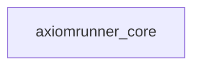
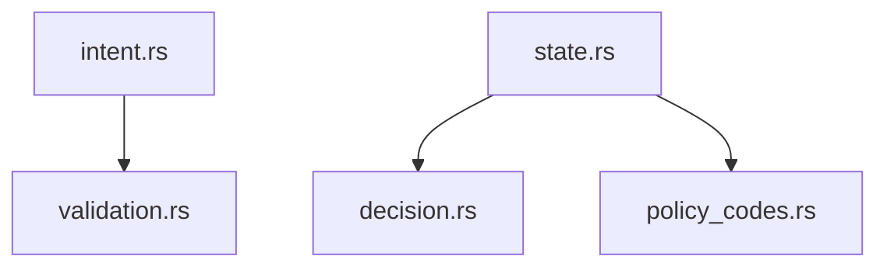

# 모듈 스펙 — `crates/core`

## 1. 역할

`crates/core`는 제품 의미를 정의하는 **가장 작은 계약 층**이다.  
여기서는 실행을 하지 않고, **입력 계약 / 상태 primitive / 결정 vocabulary / 정책 코드**만 정의한다.

---

## 2. 의존성

## 2.1 crate dependency

- 외부 의존성 없음
- 런타임/IO 없음
- side-effect 없음

## 2.2 internal module dependency

---

## 3. 모듈별 계약

## 3.1 `intent.rs`
### 소유 책임
- `RunGoal`
- `RunBudget`
- `RunConstraint`
- `DoneCondition`
- `VerificationCheck`
- `RunApprovalMode`
- goal validation
- constraint label classification

### 입력 계약
`RunGoal`은 최소 아래를 가져야 한다.

- `summary`
- `workspace_root`
- `constraints[]`
- `done_conditions[]`
- `verification_checks[]`
- `budget`
- `approval_mode`

### 중요한 규칙
- `done_conditions`는 비어 있으면 안 된다.
- `verification_checks`는 비어 있으면 안 된다.
- budget 세 축은 모두 0보다 커야 한다.
- constraint는 현재
  - `path_scope`
  - `destructive_commands`
  - `external_commands`
  - `approval_escalation`
  만 enforced subset label로 분류된다.

### 노출 API 의미
- `validate()`는 goal input을 구조적으로 잠근다.
- `RunConstraint::policy_key()`는 enforcement subset 여부를 분류한다.
- `RunConstraint::mode()`는 `Advisory | EnforcedSubset`을 돌려준다.

## 3.2 `decision.rs`
### 소유 책임
- operator/system이 goal을 받아들였는지에 대한 최소 결정 값

### 값
- `Accepted`
- `Rejected`

### 주의
- 이것은 **run outcome**이 아니다.
- 이것은 **intent acceptance**다.

## 3.3 `policy_codes.rs`
### 소유 책임
- rejection / policy reason vocabulary

### 현재 코드
- `allowed`
- `actor_missing`
- `payload_too_large`
- `constraint_path_scope`
- `constraint_destructive_commands`
- `constraint_external_commands`

### 의미
- policy code는 state/trace/report에서 rejection 이유를 압축 표현하는 canonical code다.
- `Allowed` 외 나머지는 rejection code다.

## 3.4 `state.rs`
### 소유 책임
- minimal runtime state primitive

### 상태 필드
- `revision`
- `mode`
- `last_intent_id`
- `last_actor_id`
- `last_decision`
- `last_policy_code`

### invariant
- `revision > 0`이면 `last_*` tracking field가 모두 채워져 있어야 한다.
- `record_intent()`는 새 상태를 순수하게 반환한다.
- 상태는 append/update reducer가 아니라 **immutable next-state primitive**처럼 동작한다.

---

## 4. 왜 이 구조가 맞는가

`core`가 작아야 하는 이유는 명확하다.

- `apps`가 operator flow를 바꾸더라도 core contract는 안정적이어야 한다.
- `adapters`가 backend를 바꾸더라도 goal/decision/policy/state 의미는 안정적이어야 한다.
- release gate가 잠궈야 하는 제품 vocabulary는 core에서 흔들리면 안 된다.

즉 `core`는 **semantic kernel**이어야 하며, orchestration 코드를 품지 않아야 한다.

---

## 5. 금지 사항

`crates/core`에 넣으면 안 되는 것:

- filesystem IO
- provider/tool/memory backend
- trace serialization
- artifact writing
- CLI parsing
- doctor/status/replay rendering
- retry / repair orchestration
- workflow pack loading

---

## 6. 완성 조건

`crates/core`는 아래가 참이면 충분하다.

1. goal schema와 validation이 명확하다.
2. decision/policy vocabulary가 stable하다.
3. state primitive가 minimal하고 pure하다.
4. apps/adapters가 이 타입들을 공유하면서도 core에 orchestration을 밀어 넣지 않는다.
