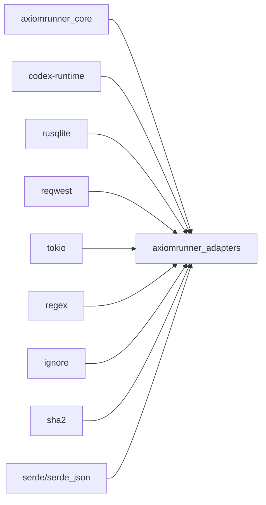
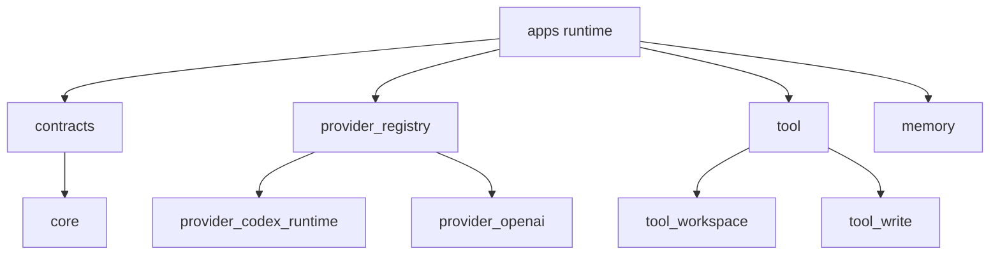

# 모듈 스펙 — `crates/adapters`

## 1. 역할

`crates/adapters`는 **AxiomRunner 본체 semantics를 실제 실행 가능한 substrate로 연결하는 계층**이다.

이 crate는 아래만 소유한다.

- provider backend
- tool backend
- memory backend
- health probe detail
- workflow-pack / tool / provider shared contract types

이 crate는 아래를 소유하면 안 된다.

- `run/resume/abort` 의미
- terminal outcome 의미
- status/replay/report schema
- verify-before-done rule
- CLI semantics

---

## 2. crate dependency

### 외부 의존성 의미
- `codex-runtime`: `codek` provider substrate
- `rusqlite`: memory backend
- `reqwest`: experimental compat provider 경로
- `ignore`: workspace file enumeration
- `sha2`: digest/evidence
- `regex`: search_files / replace boundary
- `tokio`: async provider/memory plumbing

---

## 3. 공개 모듈

`lib.rs`가 드러내는 현재 모듈은 아래와 같다.

- `contracts`
- `error`
- `memory`
- `provider_codex_runtime`
- `provider_openai`
- `provider_registry`
- `tool`
- `tool_write`
- 내부 구현: `tool_workspace`

---

## 4. 모듈별 책임

## 4.1 `contracts`
### 소유 책임
- workflow pack contract shared types
- provider/tool/memory adapter trait
- health report shape
- tool request / result / evidence schema

### 중요성
`apps`와 `adapters`가 같은 계약을 말하게 만드는 접점이다.

## 4.2 `provider_registry`
### 소유 책임
- provider id 해석
- 기본 provider 선택
- registry entry 생성

### 현재 제품 의미
- `codek`는 primary substrate
- `mock-local`은 deterministic contract path
- `openai`는 opt-in experimental compat path

## 4.3 `provider_codex_runtime`
### 소유 책임
- `codek` provider implementation
- cli bin/version/compatibility health detail 노출

### 제품 규칙
- hidden fallback 금지
- init failure는 doctor에서 visible해야 함
- compatibility mismatch는 degraded/blocked로 드러나야 함

## 4.4 `provider_openai`
### 소유 책임
- experimental compat provider

### 제품 규칙
- 기본 제품 path에 포함되지 않는다.
- opt-in 없이는 사용되면 안 된다.

## 4.5 `memory`
### 소유 책임
- contract memory backend
- memory tier 선택
- memory health/state 제공

### 제품 규칙
- memory 실패는 success로 숨기면 안 된다.
- memory는 operator-visible state를 제공해야 한다.

## 4.6 `tool`
### 소유 책임
- workspace-bounded file and command operations
- risk classification
- command class classification
- tool execution output

### 핵심 동작
- workspace root canonicalization
- file inventory / read / search
- bounded write / replace / remove
- allowlisted `run_command`
- stdout/stderr truncation
- command timeout
- artifact path 생성

### 현재 risk model
- low / medium / high
- `RunCommandClass`: `WorkspaceLocal | Destructive | External`

### 현재 분류 기준
- `rm`, `mv` => destructive
- `pwd`, `git`, `cargo`, `npm`, `node`, `python`, `pytest`, `rg`, `ls`, `cat`, `sh`, `bash`, `pnpm`, `yarn`, `uv`, `make`, `./*`, `../*` => workspace-local
- 그 외 => external

## 4.7 `tool_write`
### 소유 책임
- patch artifact
- command artifact
- before/after digest
- bounded excerpt
- unified diff

### 제품 의미
mutation evidence chain을 실제 파일로 남기는 계층이다.

## 4.8 `tool_workspace`
### 소유 책임
- workspace boundary resolution
- path canonicalization
- gitignore-respecting enumeration

---

## 5. adapters ownership boundary

## 5.1 adapters가 할 수 있는 것
- backend 제공
- health detail 제공
- tool risk classification 제공
- workflow-pack contract type 제공

## 5.2 adapters가 하면 안 되는 것
- 새 terminal outcome 도입
- replay schema 변경
- `done` 규칙 변경
- `resume/abort` semantics 변경
- blocked/success 기준 완화

---

## 6. 완성본에서 adapters가 만족해야 할 것

1. provider/tool/memory 오류를 숨기지 않는다.
2. workspace boundary를 우회하지 않는다.
3. allowlist를 우회하지 않는다.
4. mutation evidence를 항상 남긴다.
5. health detail을 doctor/status에서 읽을 수 있다.
6. workflow pack contract types는 apps와 동일 vocabulary를 유지한다.

---

## 7. dependency boundary 요약

핵심은 간단하다.  
**adapters는 실행 가능성만 소유하고, 의미는 소유하지 않는다.**
