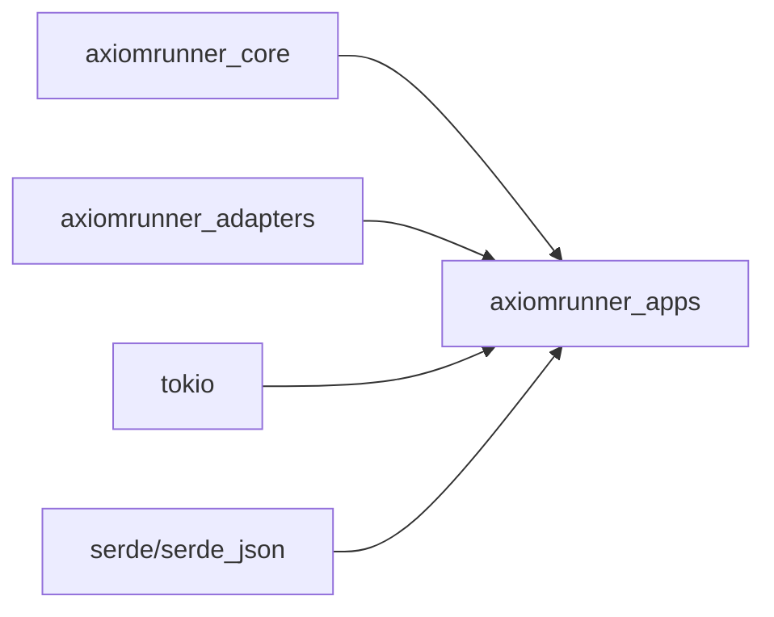
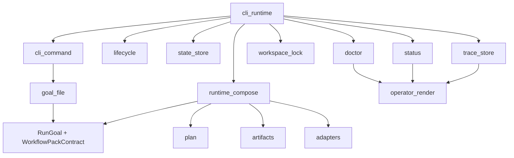

# 모듈 스펙 — `crates/apps`

## 1. 역할

`crates/apps`는 실제 제품 표면을 가진다.  
CLI entrypoint, goal/workflow-pack binding, run orchestration, state/trace persistence, operator render, doctor/status/replay, workspace lock, artifact writing이 모두 여기 있다.

즉 이 crate가 **runtime kernel**이다.

---

## 2. crate dependency

---

## 3. 내부 의존성 맵

---

## 4. 모듈별 책임

## 4.1 `cli_command.rs`
### 소유 책임
- retained CLI surface parser
- canonical usage string
- command enum

### 현재 locked surface
- `run`
- `status`
- `replay`
- `resume`
- `abort`
- `doctor`
- `health`
- `help`

### 규칙
- unknown command 거부
- `run`은 정확히 하나의 goal file 인자 필요
- `resume/replay/abort`는 정확히 하나의 target 필요
- `status`는 optional target 허용
- `doctor`는 optional `--json`만 허용

## 4.2 `goal_file.rs`
### 소유 책임
- goal file JSON parse
- approval mode parse
- RunGoal build
- optional workflow pack manifest load and validate

### 중요 규칙
- goal file validation 실패 시 run 불가
- workflow pack manifest invalid면 fail-closed
- `approval_mode`는 `never | on-risk | always`만 허용

## 4.3 `cli_runtime.rs`
### 소유 책임
- command별 실행 entrypoint
- workspace lock 적용
- snapshot load/save
- trace append
- run / resume / abort control semantics

### 핵심 흐름
1. command parse 결과를 받아 경로 선택
2. mutating command면 workspace lock 획득
3. run이면:
   - goal validate
   - pre-execution guard
   - execution workspace 준비
   - checkpoint metadata 기록
   - compose apply
   - verify
   - repair loop
   - finalize
   - report write
   - done condition 적용
   - rollback metadata 기록
   - trace append
   - state snapshot persist
4. resume이면:
   - pending approval run만 허용
5. abort이면:
   - pending control run만 허용

### 절대 규칙
- `resume`은 generic restart가 아니다.
- `abort`는 rerun이 아니다.
- execution failure는 success로 숨기면 안 된다.
- report write failure는 run failure로 승격된다.

## 4.4 `cli_runtime/lifecycle.rs`
### 소유 책임
- verify
- repair budget loop
- finalize outcome 결정
- done condition enforcement
- elapsed minute budget enforcement
- step journal 생성

### finalize semantics
- `verification.status == passed` + done conditions satisfied => `success`
- `verification_weak|verification_unresolved|pack_required` => `blocked`
- approval needed => `approval_required`
- budget guard => `budget_exhausted`
- provider blocked => `blocked`
- 그 외 verification failure => `failed`

### repair semantics
- initial verification failed && tool step failed일 때만 repair loop
- repair budget = `goal.max_steps - planned_steps`
- budget 소진 시 `repair_budget_exhausted:*`

## 4.5 `runtime_compose.rs`
### 소유 책임
- provider/memory/tool orchestration
- execution workspace binding
- constraint enforcement subset
- provider health projection
- isolated worktree preparation
- report/checkpoint/rollback write entry

### 현재 핵심 capability
- `constraint_policy_violation()`
- `constraint_requires_pre_execution_approval()`
- `prepare_execution_workspace()`
- `write_report()`
- `write_checkpoint_metadata()`
- `write_rollback_metadata()`

### constraint enforcement 현재 의미
- `path_scope` / `destructive_commands` / `external_commands`는 verifier command 수준에서 policy rejection 가능
- `approval_escalation`은 high-risk verifier면 pre-execution approval 요구

## 4.6 `runtime_compose/plan.rs`
### 소유 책임
- runtime run plan assembly
- default goal workflow pack generation
- verifier command derivation
- verifier fallback strength labeling

### 중요 의미
- default workflow pack id: `goal-default-v1`
- verification detail이 command면 direct command 사용
- command로 파싱 못 하면 fallback probe 사용
- fallback probe는
  - `weak`
  - `unresolved`
  - `pack_required`
  로 strength를 태깅
- placeholder verifier를 success 근거로 삼으면 안 된다

## 4.7 `runtime_compose/artifacts.rs`
### 소유 책임
- `plan/apply/verify/report` markdown artifact write
- patch artifact aggregation
- checkpoint / rollback json write

### report가 반드시 담아야 하는 것
- run phase / outcome / reason
- reason code / detail
- verifier strength / summary
- provider health
- changed_paths
- patch artifact path
- evidence summary
- checkpoint / rollback summary
- next action

## 4.8 `state_store.rs`
### 소유 책임
- runtime state snapshot persistence
- versioned snapshot parse/serialize
- tmp fallback load
- pending run snapshot persistence

### 현재 snapshot contract
- version: `axiomrunner-state-v2`
- legacy migration 없음
- pending run 필수 필드 누락 시 load 실패
- temp write + rename
- primary corrupt/missing 시 tmp fallback 시도

## 4.9 `trace_store.rs`
### 소유 책임
- append-only trace event store
- replay summary
- artifact index
- false success / false done metrics

### 현재 핵심 metric
- `failed_intents`
- `false_success_intents`
- `false_done_intents`
- `latest_failure`

### false-success 의미
accepted intent인데 run outcome이 success가 아닌 경우

### false-done 의미
accepted intent인데 done condition failure로 success를 잃은 경우

## 4.10 `workspace_lock.rs`
### 소유 책임
- single-writer lock acquisition
- stale lock auto-recovery
- lock path canonicalization

### 규칙
- mutating command만 lock 필요
- stale pid면 1회 auto-recovery
- live holder면 즉시 거부

## 4.11 `status.rs`
### 소유 책임
- state/runtime snapshot projection type
- operator status output input shape

### 의미
status는 truth source가 아니라 **projection layer**다.

## 4.12 `doctor.rs`
### 소유 책임
- provider/memory/tool health
- lock state
- filesystem paths
- pending run diagnostic projection

### 의미
doctor는 실행 결과가 아니라 **현재 runtime readiness + path + pending control state**를 보여 준다.

## 4.13 `operator_render.rs`
### 소유 책임
- status / doctor / replay canonical human-readable lines
- reason_code / reason_detail / verifier_strength projection
- changed_paths / rollback metadata / replay summary 노출

### 제품 중요성
문서 계약과 operator mental model이 여기서 실제 문자열이 된다.

---

## 5. apps가 지켜야 할 구조 규칙

## 5.1 source of truth 분리
- `core` = semantic primitive truth
- `state_store` = persisted control state truth
- `trace_store` = execution evidence truth
- `operator_render` = projection only

## 5.2 drift 금지
아래 vocabulary는 status/replay/doctor/report에서 같아야 한다.

- phase
- outcome
- reason
- reason_code
- reason_detail
- verifier_state
- verifier_strength
- approval_state

## 5.3 fail-closed 원칙
- invalid goal file => reject
- invalid workflow pack => reject
- report write 실패 => fail
- unreadable verifier evidence => fail
- weak/unresolved/pack_required => blocked
- provider/tool/memory failure => fail or blocked, but never silent success

---

## 6. 완성본에서 apps가 만족해야 할 것

1. CLI surface drift가 없다.
2. run/resume/abort semantics가 고정돼 있다.
3. state snapshot, trace, report가 같은 run 의미를 말한다.
4. workflow pack은 runtime semantics를 넘어서지 못한다.
5. constraint enforced subset이 실제 behavior로 연결된다.
6. operator outputs가 release docs와 같은 vocabulary를 사용한다.

---

## 7. 지금 건드리면 안 되는 것

- command surface 확대
- daemon/service/gateway 추가
- channel integration
- multi-agent orchestration
- non-essential new adapter surface
- state/trace vocabulary 변경

이 crate는 지금 **기능 확장**보다 **의미 고정**이 우선이다.
