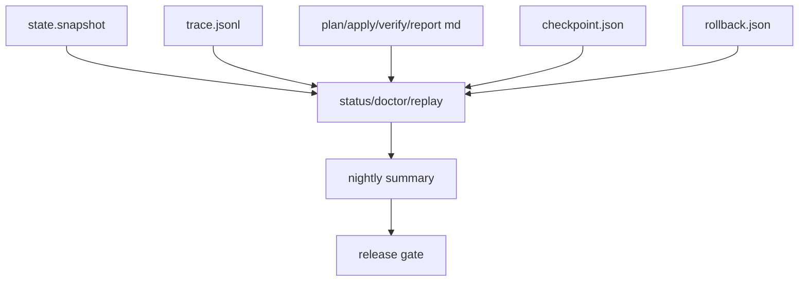

# 운영 / Evidence / Release 스펙

## 1. 목적

이 문서는 AxiomRunner를 제품급으로 마무리할 때 가장 중요한 **operator truth layer**를 명세한다.

핵심 질문은 하나다.

> **운영자는 run 이후 무엇을 보고, 무엇을 믿고, 무엇으로 다음 행동을 결정하는가?**

---

## 2. operator truth stack

### 해석
- state는 control truth
- trace는 execution truth
- report/checkpoint/rollback은 artifact truth
- status/doctor/replay는 projection truth
- nightly/release는 production-readiness truth

---

## 3. doctor contract

`doctor`는 **run 결과 조회**가 아니라 **현재 runtime readiness와 operator context 조회**다.

## 3.1 required fields
- provider_state
- provider_detail
- memory_state
- tool_state
- lock_state
- lock_path
- workspace_path
- artifact_path
- state_path
- memory_path
- pending_run

## 3.2 operator questions
doctor는 최소 아래 질문에 답해야 한다.

1. 지금 provider가 ready/degraded/blocked 중 무엇인가?
2. 어떤 CLI binary/version/compatibility를 보고 있는가?
3. tool/memory가 켜져 있는가?
4. workspace lock이 active/stale/absent 중 무엇인가?
5. 현재 pending run이 있는가?
6. resume/abort 가능한 대상이 있는가?

---

## 4. status contract

`status`는 현재 또는 latest run의 **control summary**다.

## 4.1 required run fields
- run_id
- phase
- outcome
- reason
- approval_state
- execution_workspace
- verifier_state
- verifier_strength
- verifier_summary
- planned_steps
- step_count
- artifact_summary

## 4.2 pending run fields
- run_id
- goal_file_path
- phase
- reason
- approval_state
- verifier_state
- verifier_strength

## 4.3 status의 역할
status는 아래를 빠르게 알려야 한다.

- 지금 이 run은 끝났는가 / 막혔는가 / 승인 대기인가?
- 왜 그런가?
- resume 대상인가?
- abort 대상인가?
- 어떤 workspace에서 실행되었는가?

---

## 5. replay contract

`replay`는 operator가 **사후 분석**할 수 있게 만드는 핵심 인터페이스다.

## 5.1 replay가 보여야 하는 것
- health summary
- intent count
- failed_intents
- false_success_intents
- false_done_intents
- latest_failure
- run phase/outcome/reason
- reason_code
- reason_detail
- approval_state
- verifier_state
- verifier_strength
- elapsed_ms
- planned_steps
- run summary
- verifier evidence
- step journal
- patch artifact paths
- changed_paths
- rollback metadata

## 5.2 replay 품질 조건
operator가 replay만 보고 아래를 재구성할 수 있어야 한다.

1. 어떤 goal/run이었는가
2. 왜 success/blocked/failed/budget/approval가 되었는가
3. verifier가 strong/weak/unresolved/pack_required 중 무엇이었는가
4. 어떤 파일이 바뀌었는가
5. rollback/checkpoint가 있었는가
6. 다음 액션이 무엇인가

---

## 6. report artifact contract

각 run은 최소 아래 4종 artifact를 남긴다.

- `*.plan.md`
- `*.apply.md`
- `*.verify.md`
- `*.report.md`

## 6.1 `plan.md`
- goal summary
- run_id / intent_id
- workflow_pack
- verifier_flow
- done_when
- planned steps

## 6.2 `apply.md`
- provider
- memory
- tool
- effects
- provider cwd
- provider output

## 6.3 `verify.md`
- verification status
- verification summary
- checks
- verifier evidence
- repair attempted/attempt count/status/summary
- first failure

## 6.4 `report.md`
- run phase / outcome / reason
- run_reason_code
- run_reason_detail
- verifier_strength
- verifier_summary
- verifier_non_executed_reason
- checkpoint summary
- rollback summary
- provider health state/detail
- outputs
- changed_paths
- patch_artifacts
- evidence
- next_action

---

## 7. checkpoint / rollback contract

## 7.1 checkpoint
isolated worktree 실행을 시작할 때 checkpoint를 남긴다.

### required fields
- schema
- run_id
- intent_id
- reason
- restore_path
- execution_workspace

## 7.2 rollback
isolated worktree run이 `failed` 또는 `blocked`로 끝나면 rollback metadata를 남긴다.

### required fields
- schema
- run_id
- intent_id
- reason
- restore_path
- cleanup_path
- execution_workspace
- provider_cwd

## 7.3 operator rule
- `abort`는 pure terminal control이므로 rollback metadata를 새로 만들지 않는다.
- operator는 replay와 report의 rollback 줄부터 읽는다.

---

## 8. trace contract

## 8.1 append policy
- JSONL append-only
- trailing partial line 1개까지 read-while-write 복구 허용
- 완성된 malformed line은 corruption으로 실패

## 8.2 replay summary metrics
- `failed_intents`
- `false_success_intents`
- `false_done_intents`
- `latest_failure`

## 8.3 why this matters
이 metric은 단순 로그가 아니라 **제품 신뢰성 지표**다.

- `false_success_intents > 0` => operator가 성공을 믿을 수 없음
- `false_done_intents > 0` => done condition 체인이 깨짐

---

## 9. nightly dogfood contract

## 9.1 실행 방식
- GitHub CI 강제가 아니라도 `scripts/nightly_dogfood.sh`로 반복 실행 가능
- fixture별 isolated workspace/artifact/state path 생성
- 각 fixture마다 `run`, `replay latest`, `doctor --json` 로그 저장

## 9.2 summary required metrics
- `run_rc`
- `replay_rc`
- `doctor_rc`
- `failed_intents`
- `false_success_intents`
- `false_done_intents`
- `weak_verifications`
- `unresolved_verifications`
- `pack_required_verifications`

## 9.3 green 정의
nightly green은 단순 exit code 0이 아니다.

- `false_success_intents=0`
- `false_done_intents=0`
- `weak_verifications=0`
- `unresolved_verifications=0`
- `pack_required_verifications=0`

이어야 한다.

---

## 10. release gate contract

release gate는 최소 아래를 막아야 한다.

### 10.1 truth lock
- retained command set drift
- identity drift
- legacy token 재등장
- docs current truth / bridge truth 혼동
- workflow pack contract source duplication

### 10.2 autonomy lock
- placeholder verifier 허용
- weak/unresolved/pack_required success 위장
- false success summary green
- rollback evidence 누락
- representative example/fixture 누락

### 10.3 acceptance rule
release는 “테스트가 돌아간다”가 아니라,
**계약 drift가 없다**가 입증돼야 한다.

---

## 11. 완성 조건

operator truth layer는 아래가 모두 만족되면 완성이다.

1. doctor/status/replay/report가 같은 vocabulary를 사용한다.
2. false-success / false-done 지표가 자동 측정된다.
3. rollback/checkpoint가 isolated worktree 운영을 닫는다.
4. nightly summary가 quality metrics를 포함한다.
5. release gate가 legacy/placeholder/drift를 차단한다.
